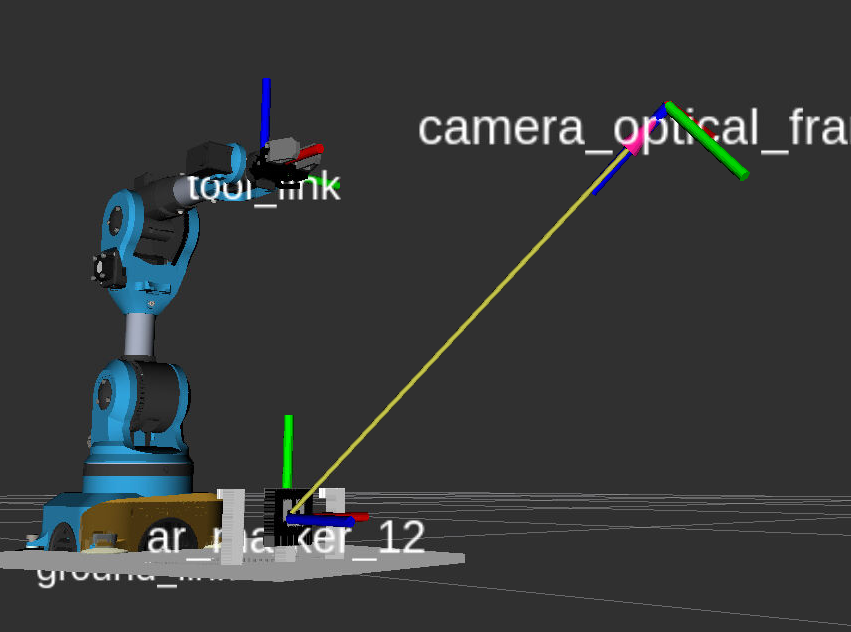

# Lab Transformations				

# Introduction and Prerequisites

In this lab you will explore the use of Augmented Reality tags and a ROS library for identifying and tracking these tags, or bundles of multiple tags, using camera images (see this page for more details on the ROS package we are going to use [http://wiki.ros.org/ar_track_alvar](http://wiki.ros.org/ar_track_alvar) ) 

To reach the objectives of the lab you will also get more confidence with the use of **coordinate frames** and **coordinate transformations** in ROS using TF / TF2. 

## Useful documentation

Use of aruco tags: [http://wiki.ros.org/ar_track_alvar](http://wiki.ros.org/ar_track_alvar) 

# Time & Assessment

The entire session will take 90 minutes.

# Task 1 - Tracking an AR tag in simulation

Access the following repository and fork it https://github.zhaw.ch/RAP-EN/RAP_POSE_LAB.git

Now that you have forked it, clone the forked repository under your persistent folder on the k8s cluster, i.e., catkin_ws/src/rap, build the project and source the workspace first.

In this task you will detect the position of AR tags using a simulated camera. 

Launch the simulation with the command below and wait until Rviz is started:

 `roslaunch icclab_grasping_niryo niryo_pickandplace_sim.launch world_name:=box_with_marker.world`
 
Verify the presence of the AR tag in the world in Gazebo and RViz (activate the point cloud and the image plugins of the camera). 

You will use the ar_track_alvar package (see [http://wiki.ros.org/ar_track_alvar](http://wiki.ros.org/ar_track_alvar) )  to detect the AR tags in the simulated environment. Launch the aruco detector with the following commmand:

 `roslaunch rap_pose_lab_niryo aruco_detect_indiv_no_kinect.launch`

Now you can activate a “marker” in RviZ that shows any aruco tag detected by the camera (add the required plugin). Aruco also publishes the corresponding TF.  

Use the command `rosrun rqt_tf_tree rqt_tf_tree` to **visualize the TF tree**. Note that **the TF tree needs to be completely connected** in order to compute transformations to and from each frame.

You can now **verify what topics the ar_trackar_alvar node is publishing and identify the poses and the id for the identified aruco tag**.

Similarly, you can visualize what the “/visualizazion_marker” pose is for the detected marker. **Notice the frame_id** of the two published topics as we will use this information for the following task. 

# Task 2 - Grasp an object identified by a marker in simulation

### Subtask 2.1 – Grasp in Simulation

In this task you will have to **grasp an object in the simulated environment** (Gazebo) and move it somewhere else before releasing it. 

If needed, relaunch the simulation environment with:

 `roslaunch icclab_grasping_niryo niryo_pickandplace_sim.launch world_name:=box_with_marker.world`

You will have to identify the pose of the object to grasp using the kinect camera and the aruco marker placed right in front of the object. We provide you with the “grasp_marker.py”  script in the `rap_pose_lab_niryo/rap_pose_lab_niryo/scripts` folder, you should extend it to perform the needed tasks. Start by reading it to understand its organization.

 

The task is composed of the following steps:

* Use ar_track_alvar to identify the marker pose (as in Task 1)
* Use the marker pose to **compute a “grasp pose”** (msg type: PoseStamped) that will **place the gripper 7 cm above the marker** (picking from above)
* Visualize the grasp pose through rviz (a display tool called “Pose” is pre-configured in your RViz listening to topic “/grasp_pose_from_marker”)
* Send the grasp pose to the arm movement planner, verify the plan, trigger the arm movement
* Close the gripper
* Move arm to another given pose, verify the plan, trigger the arm movement
* Open the gripper

We provide you with a few hints below to guide you towards the solution of the exercise.

**Hints:**

* To which topic do you need to subscribe to receive the marker pose?
* With respect to which coordinate frame is the detected marker pose published?
* Which coordinate frame is it “easier to use” for planning a grasp “above” the marker object? What does it even mean “above the marker”? With respect to which frame? Use Rviz to look at the frames that are defined
* How do you define the orientation of the “grasp pose”? Notice that the planner for the arm movement will align the “tool_link” frame of the robot to the pose you give it as a goal.

**Extra Hints (read only if you’re stuck):**

* To be able to grasp the object associated with the marker, you will have to transform the pose of the marker in the frame of the robot, namely “ground_link” . After performing this transformation you can add 7 cm to that pose in the “upwards direction” (z)
* To get the orientation right in this exercise you should only think in terms of the frame you are using to plan the grasp (ground_link) and what rotation you would need to apply to transform it so that its X axis (red) points downwards. You can then apply the quaternion for that (90 degrees) rotation directly to the pose orientation component. 
* Alternatively, you can use the python ‘function rotate_pose_msg_by_euler_angles’ to rotate the pose correctly for the gripper (the solution for this is given to you in the script but commented: pose_goal = rotate_pose_msg_by_euler_angles(pose_goal.pose,  math.pi,  math.pi, math.pi / 2 ) 
* Use the gripper_client function to open and close the gripper to grasp/release the object identified by the marker (as provided in the example)
* After grasping the object move the arm in another position using moveit in the script and release the object (the solution for planning with moveit is given to you as part of the class niryo_moveit)

## Task 3 – Test the script on the HW

Once your code is working in simulation you can test it on real robots. To do this ask the lab assistants to support you in setting up the connection for your group. After the connection to the robot is setup you will need the following commands to be run in different windows:

`roslaunch rosbridge_server rosbridge_websocket.launch`

`roslaunch icclab_grasping_niryo static_camera_transformation_publisher.launch`

`roslaunch rap_pose_lab_niryo aruco_detect_indiv_no_kinect.launch`

`roslaunch icclab_grasping_niryo moveit_rviz_fakegripper.launch`

Once everything is running you can launch your python script to test it on the arm.

## Task 4 – Important: Cleanup!

When you are done with the lab, please remove all deployments on the k8s cluster by using the `rap-lab-remove.sh` script.
